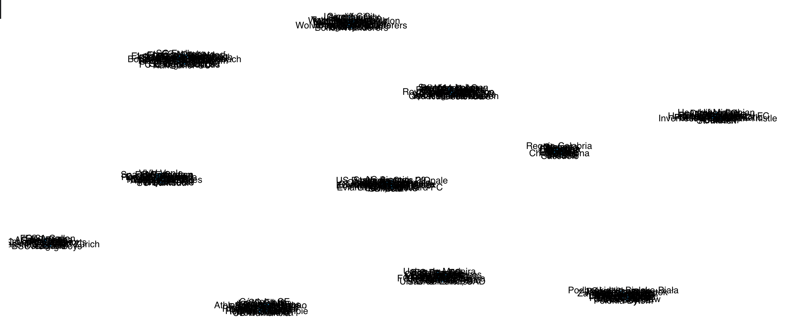
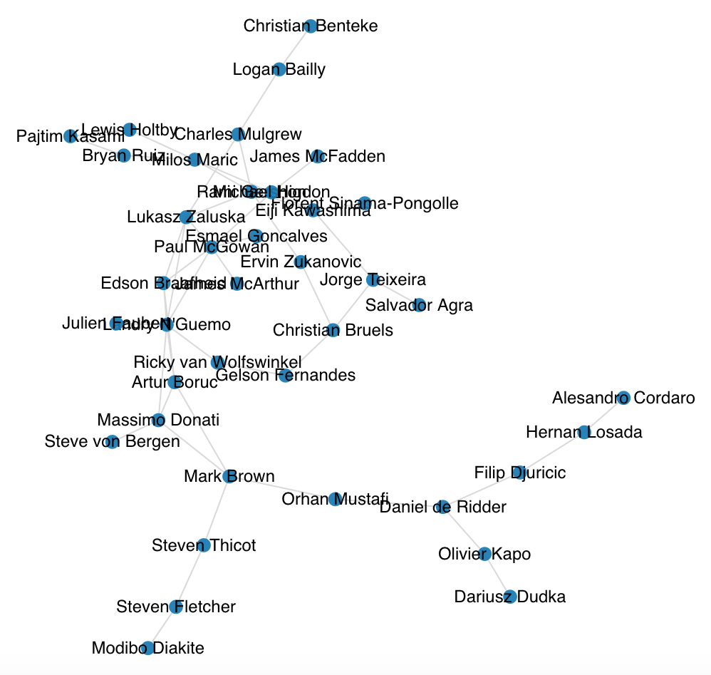

# Data Management – Project 3 – WP 0

## Team-Information

### Cypher-Queries

#### Create nodes for teams
```cypher
LOAD CSV WITH HEADERS FROM 'file:///teams.csv' AS row
WITH toInteger(row.id) as teamID, row.long_name as teamName
MERGE (t:Team {teamID: teamID})
SET t.teamID = teamID, t.teamName = teamName
RETURN count(t)
```

#### Create nodes for players
```cypher
LOAD CSV WITH HEADERS FROM 'file:///players.csv' AS row
WITH toInteger(row.id) as playerID,
row.name as playerName
MERGE (p:Player {playerID: playerID})
SET p.playerID = playerID, p.playerName = playerName
RETURN count(p)
```

#### Increase search-performance
*Since there is a lot of data, I created a unique indexes for the players and the teams to increase the search-performance in Neo4j.*

```cypher
CREATE CONSTRAINT uniquePlayer FOR (p:Player) REQUIRE p.playerID IS UNIQUE
````

```cyper
CREATE CONSTRAINT uniqueTeam FOR (t:Team) REQUIRE t.teamID IS UNIQUE
```

#### Create relationship between teams
```cypher
LOAD CSV WITH HEADERS FROM "file:///games.csv" AS row
WITH toInteger(row.id) AS gameID,
row.date AS date,
toInteger(row.away_team_id) AS awayTeam,
toInteger(row.home_team_id) AS homeTeam

MATCH (t1:Team {teamID: homeTeam})
MATCH (t2:Team {teamID: awayTeam})

MERGE (t1) – [rel: PLAYED_AGAINST {date:date}] - (t2)
return count(rel)
```
The reason I used the date in the relationship, is because I later want to see, how many games the teams played in total, so I created a relationship for every date they played against eachother. The date is a datetime-object, so even if a team played against another team more than once a day, it can be distinguished. I could have used to game-id as well, but I decided to use the date, because the information is more readable. Another possibility would be to use CALL {} IN TRANSACTIONS to count the number of relationships, but I found out about that too late.*


### Results - League-Information

#### COMMUNITY DETECTION / STRONGLY CONNECTED COMPONENTS
The following table shows the strongly connected components of the graph formed by the connection between teams through the games they played against each other. So we probably see the Leagues in which the teams played during the season. Unfortunately I didn't load the League-information in the Neo4j-Database, so I can't access the league-name and the assossiated country.*


| Community | Size | Node |
| ---- | ---- | ---- |
| 9 | 35 | Évian Thonon Gaillard FCUS Boulogne Cote D'OpaleGFC AjaccioSC BastiaSM CaenAngers SCOAS Nancy-LorraineStade Brestois 29FC MetzAC Ajaccio |
| 54 | 34 | Burnley Leicester City Cardiff City Chelsea Manchester City Portsmouth Southampton Sunderland Blackpool Wigan Athletic |
| 30 | 33 | Córdoba CFGranada CFSevilla FCGetafe CFUD Las PalmasAthletic Club de BilbaoRayo VallecanoCA OsasunaSD EibarCD Numancia |
| 11 | 32 | Novara Sassuolo Atalanta Cagliari Catania Chievo Verona Empoli Fiorentina Livorno Palermo |
| 50 | 30 | FC St. Pauli1. FC NürnbergHertha BSC BerlinBayer 04 LeverkusenFortuna DüsseldorfTSG 1899 HoffenheimFC Ingolstadt 04SV Darmstadt 98Karlsruher SC1. FC Kaiserslautern |
| 3 | 29 | S.C. OlhanenseFeirenseUniao da MadeiraFC Paços de FerreiraLeixões SCFC PenafielRio Ave FCEstoril PraiaVitória GuimarãesTrofense |
| 1 | 25 | Oud-Heverlee LeuvenTubizeKAS EupenFCV Dender EHKV MechelenClub Brugge KVWaasland-BeverenKV KortrijkKV OostendeRSC Anderlecht |
| 16 | 25 | PEC ZwolleGo Ahead EaglesFC VolendamFC DordrechtSC CambuurVitesseN.E.C.Willem IIDe GraafschapAjax |
| 0 | 24 | Ruch ChorzówJagiellonia BiałystokLech PoznańP. WarszawaCracoviaGórnik ŁęcznaPolonia BytomZagłębie LubinPogoń SzczecinWidzew Łódź |
| 48 | 17 | Inverness Caledonian ThistleDundee FCPartick Thistle F.C.Hamilton Academical FCDunfermline AthleticSt. Johnstone FCAberdeenRangersFalkirkKilmarnock |
| 19 | 15 | AC BellinzonaFC Lausanne-SportsLuganoNeuchâtel XamaxServette FCFC VaduzFC AarauFC BaselGrasshopper Club ZürichFC Sion |





## Player-Information

### Cypher-Queries
```cypher
Load CSV With Headers FROM 'file:///player_links.csv' AS row
WITH toInteger(row.pID1) as pID1, toInteger(row.pID2) as pID2, toInteger(row.nGames) as n
MATCH (p1:Player {playerID:pID1})
MATCH (p2:Player {playerID:pID2})
MERGE (p1)-[r:PLAYED_WITH {times:n}]-(p2)
return count(r)
```

### CENTRALITIES / DEGREE
The following table shows the 10 players who played with the most different other players in the same team.


| Node	| Score |
| --- | --- |
| Gelson Fernandes | 176 |
| Felipe | 169 |
| Pablo Osvaldo | 165 |
| Modibo Diakite | 165 |
| Marco Borriello | 164 |
| Aleandro Rosi | 160 |
| Lewis Holtby | 157 |
| Matias Ezequiel Schelotto | 156 |
| Alberto Aquilani | 155 |
| Sergio Floccari | 154 |


### CENTRALITIES / BETWEENNESS
The following table shows the players with the highest betweenness. That means, the most shortest paths among all shortest paths between each pair of players go through these players.

| Node | Score | 
| --- | --- |
| Steven Fletcher | 317326.55528992414 |
| Ricky van Wolfswinkel | 299551.2653929617 |
| Gelson Fernandes | 294804.3044385581 |
| Ervin Zukanovic | 240355.372887137 |
| Eiji Kawashima | 230984.1325157935 |
| Milos Maric | 226701.39775332063 |
| Paul McGowan | 220529.80953330503 |
| Daniel de Ridder | 219453.47919396107 |
| Mark Brown | 210841.67107300702 |
| Esmael Goncalves | 207584.05434551585 |





