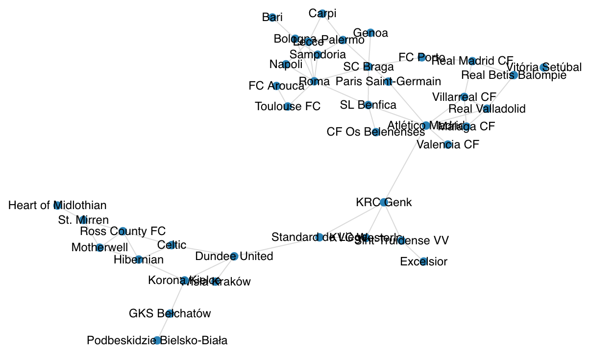

# Data Management – Project 3 – WP 6
## Graph Database – the 10 most important nodes (CENTRALITY DEGREE)

*The table shows the teams who played the most games against other teams with a goalkeeper who once played for them*

| Node | Score |
| ------ | ------ |
| Atlético Madrid | 14 |
| Sint-Truidense VV | 11 |
| Sampdoria | 11 |
| Grasshopper Club Zürich | 11 |
| SL Benfica | 10 |
| SC Braga | 10 |
| CF Os Belenenses | 9 |
| Genoa | 9 |
| Real Madrid CF | 8 |
| KRC Genk | 8 |

